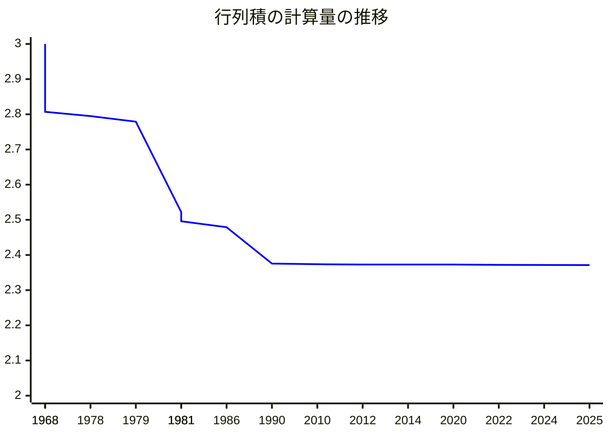

# 行列積アルゴリズムの誤り訂正

[Nobutaka Shimizu](https://sites.google.com/view/nobutaka-shimizu/home) (Institute of Science Tokyo)

June 5th, 2025

---
layout: top-title
color: amber-light
---

::title::

# トークの内容

::content::

平原 秀一さん(NII)との二つの共著論文をマージした内容
- Error-Correction of Matrix Multiplication Algorithms (STOC'25)
- An Optimal Error-Correcting Reduction for Matrix Multiplication (ICALP'25)

<v-clicks>

- 「行列積に関する単純な問題を**誤り訂正符号**を使って解決した」という論文

- 評価はとても良かった (**STOC**と**ICALP**のreviewerの評価はそれぞれ Accept $\times 3$)
  - Overall I think it's a very nice result with very interesting techniques, and it should be appealing to a broad audience. I recommend accepting the paper.
  - The results in the paper are strong, building upon previously studied questions of worst-case-to-average-case reductions for matrix multiplication.
- トークの内容: 結果の説明 + 誤り訂正符号入門 + 証明のアイデア

</v-clicks>

---
layout: top-title
color: amber-light
---

::title::

# 行列積

::content::

入力として与えられた二つの行列$A,B\in\mathbb{F}^{n\times n}$に対して$AB$を計算せよ ($\mathbb{F}$は有限体).

行列積の計算量を$O(n^\omega)$とする. <v-click>$\omega$の値は35年間で$0.0046$しか改善していない.</v-click>

| 年 | $\omega$ | 論文 |
|:--:|:--|:--|
| 1968 | $2.807$ | [Strassen](https://link.springer.com/article/10.1007/BF02165411) |
| 1978 | $2.795$ | [Pan](https://ieeexplore.ieee.org/document/4567976) |
| 1979 | $2.779$ | [Bini, Capovani, Romani, Lotti](https://www.sciencedirect.com/science/article/pii/0020019079901133) |
| 1981 | $2.522$ | [Schönhage](https://epubs.siam.org/doi/10.1137/0210032) |
| 1981 | $2.517$ | [Romani](https://epubs.siam.org/doi/10.1137/0211020) |

| 年 | $\omega$ | 論文 |
|:--:|:--|:--|
| 1981 | $2.496$ | [Coppersmith, Winograd](https://ieeexplore.ieee.org/document/4568320) |
| 1986 | $2.479$ | [Strassen](https://ieeexplore.ieee.org/document/4568194) |
| **1990** | $2.3755$ | [Coppersmith, Winograd](https://www.sciencedirect.com/science/article/pii/S0747717108800132?via%3Dihub) |
| 2010 | $2.3737$ | [Stothers](https://era.ed.ac.uk/handle/1842/4734) |
| 2012 | $2.3729$ | [Williams](https://dl.acm.org/doi/10.1145/2213977.2214056) |

| 年 | $\omega$ | 論文 |
|:--:|:--|:--|
| 2014 | $2.3728639$ | [Le Gall](https://dl.acm.org/doi/10.1145/2608628.2627493) |
| 2020 | $2.3728596$ | [Alman, Williams](https://theoretics.episciences.org/14213) |
| 2022 | $2.371866$ | [Duan, Wu, Zhou](https://ieeexplore.ieee.org/document/10353208) |
| 2024 | $2.371552$ | [Williams, Xu, Xu, and Zhou](https://epubs.siam.org/doi/10.1137/1.9781611977912.134) |
| **2025** | $2.371339$ | [Alman, Duan, Williams, Xu, Xu, and Zhou](https://epubs.siam.org/doi/10.1137/1.9781611978322.63) |

---
layout: top-title
color: amber-light
---

::title::

# 行列積の計算量の推移

::content::

---
layout: top-title
color: amber-light
---

::title::

# 行列積の計算量の推移

::content::

<figure>

<figcaption style="text-align: center; font-size: 0.8em; color: #666;">

0.0046 / 35年 の改善率が持続すると, $O(n^2)$時間まであと3122年かかる.

</figcaption>
</figure>

---
layout: top-title
color: amber-light
---

::title::

# 行列積の近似

::content::

入力として与えられた二つの行列$A,B\in\mathbb{F}^{n\times n}$に対して, 行列$C\in\mathbb{F}^{n\times n}$であって,
$AB$と $\textcolor{e65100}{\alpha}\cdot n^2$個の成分が一致するものを(何でもよいので)計算せよ.

<v-clicks>

- $\alpha = 1$は通常の行列積
- $\alpha = \frac{1}{\abs{\F}}$なら簡単 (ランダムな行列を出力すればよい)
- 「非自明なアルゴリズム」: $\alpha \ge \frac{1}{\abs{\F}} + \varepsilon$ を達成

$\widetilde{O}(n^2)$時間で非自明な$\alpha$を達成できるか? ($\widetilde{O}(\cdot)$は$\polylog(n)$倍を無視したオーダー)

</v-clicks>

---
layout: top-title
color: amber-light
---

::title::

# 動機

::content::

- 高速行列積の多くのアルゴリズムは非実用的
  - 定数倍が非常に大きい ($n>10^{155}$じゃないとStrassenより早くならない <a href="https://epubs.siam.org/doi/10.1137/1.9781611978322.61" class="cite-reference">\[Alman, Yu, 2025\]</a>)

<v-clicks>

- 物理系を利用した(実用性を意識した)行列積アルゴリズム
  - 水流 <a href="https://drops.dagstuhl.de/entities/document/10.4230/LIPIcs.ITCS.2024.96" class="cite-reference">\[Valinat, 2024\]</a>
  - 熱力学系 <a href="https://openreview.net/forum?id=6flkWTzK2H" class="cite-reference">\[Coles et al, 2023\]</a>
  - 光学デバイス <a href = "https://www.nature.com/articles/s41377-022-00717-8" class="cite-reference">\[Zhou et al, 2022\]</a>

  これらのアルゴリズムは物理系のホワイトノイズによるエラーが発生しうる (近似行列積を解く).

</v-clicks>

---
layout: top-title
color: amber-light
---

::title::

# Problem Setting (Formal)

::content::

二つの行列$C,D\in \mathbb{F}^{n\times n}$の**一致率** $\agr(C,D)$を以下で定義する:

$$
  \begin{align*}
    \agr(C,D) &:= \Pr_{i,j\sim[n]}[C(i,j) = D(i,j)]
  \end{align*}
$$

このとき, 行列$C$は$D$と**一致率$\alpha$を持つ**という.

<v-clicks>

- **近似行列積**: 与えられた$A,B\in\mathbb{F}^{n\times n}$に対して$\agr(C,AB)\ge \alpha$を満たす行列$C$を求めよ.
- アルゴリズム$M$は任意の$A,B\in\mathbb{F}^{n\times n}$に対して$\agr(M(A,B)),AB)\ge \alpha$を満たすとき, **一致率$\alpha$を持つ**という.
  - $\alpha$に寄与する成分は入力$A,B$毎に異なりうる
  - $\alpha=1$のとき, 全成分を正しく計算

</v-clicks>

---
layout: top-title
color: amber-light
---

::title::

# 主結果 (最悪時)

::content::

任意の$\alpha\in(0,1]$を考える.
サイズが$p=\abs{\F}>10n/\alpha^2$であるような有限体を考える.
このとき, 一致率$\alpha$を持つ$T(n)$時間アルゴリズムが存在するならば,
一致率$1$を持つ$\widetilde{O}(T(n)\poly(1/\alpha) \cdot \polylog(\abs{\F}))$時間アルゴリズムが存在する.

- 非常に大きい体$\F$上では「1\%の成分さえ計算できれば全ての成分が計算できる」

<v-clicks>

任意の$\varepsilon\in(0,1]$を考える.
任意の要素数が素数であるような有限体$\F$に対し, 以下が成り立つ:
一致率$\alpha\ge \frac{1}{\abs{\F}}+\varepsilon$を持つ$T(n)$時間アルゴリズムが存在するならば,
一致率$1$を持つ$\widetilde{O}_{p,\varepsilon}(T(n))$時間アルゴリズムが存在する.

- 体のサイズ$p=\abs{\F}$が定数のときはタイトな一致率
- 隠された定数倍は非常に大きい: $2^{2^{\poly(p/\varepsilon)}}$

</v-clicks>

---
layout: top-title
color: amber-light
---

::title::

# 主結果 (平均時から最悪時への帰着)

::content::

前ページの結果では, 近似アルゴリズムは**任意の**入力に対する一致率の保証が必要であったが,
ランダムな入力に対する平均的な一致率の保証からでも同様の結果が示せる.
アルゴリズム$M$の**平均一致率**を以下で定める:

$$
  \begin{align*}
    \Exp_{\substack{A,B\sim\Fp^{n\times n}}}[\agr(M(A,B),AB)]
  \end{align*}
$$

<v-clicks>

任意に$\alpha\in(0,1]$を固定し, $p=\abs{\F}>10/\alpha$を満たす有限体$\F$を考える.
このとき, 平均一致率$\alpha$を持つ$T(n)$時間アルゴリズムが存在するならば,
任意の入力$A,B\in\F^{n\times n}$に対し

$$
  \begin{align*}
    \Pr_{M'}[M'(A,B)=AB] &\ge \frac{2}{3}
  \end{align*}
$$

を満たす$\widetilde{O}(T(n)\poly(1/\alpha))$時間アルゴリズム$M'$が存在する.

- **平均時から最悪時への帰着**: 平均的な入力で計算できる $\Rightarrow$ 任意の入力で計算できる
- 平均一致率が$\alpha = 1/\abs{\F}+\varepsilon$の場合も同様の結果が成り立つ.

</v-clicks>

---
layout: top-title
color: amber-light
---

::title::

# 関連結果

::content::

- <a class="cite-reference" href="https://drops.dagstuhl.de/entities/document/10.4230/LIPIcs.APPROX/RANDOM.2024.34">\[Gola, Shinkar, Singh, RANDOM'24\]</a>
  - $\F=\F_2$かつ**片側エラー**の設定下における同様の結果 (片側エラー: $(AB)_{i,j}=1$ならば必ず$M(A,B)_{i,j}=1$だが, $(AB)_{i,j}=0$のときは$M(A,B)_{i,j}=1$になりうる)
  - 平均一致率$\alpha>\frac{8}{9}$をもつアルゴリズムから一致率$1$を持つアルゴリズムを構成

<v-clicks>

- $\agr(AB,C)\ge 1-1/n$を満たす$A,B,C\in\F^{n\times n}$が入力として与えられたときに$AB$を計算 <a href="https://link.springer.com/article/10.1007/s00453-016-0202-3" class="cite-reference">\[Gąsieniec, Levcopoulos, Lingas, Pagh, Tokuyama, Algorithmica'17 \]</a>
  - 問題設定は我々よりも制限的だが$\alpha$は非常に$1$に近くなければならない

- 行列積に対する最悪時から平均時への帰着
  - <a href="https://www.sciencedirect.com/science/article/pii/002200009390044W?via%3Dihub" class="cite-reference">\[Blum, Luby, Rubinfeld, JCSS'93\]</a>
  - <a href="https://dl.acm.org/doi/10.1145/3519935.3520041" class="cite-reference">\[Asadi, Golovnev, Gur, Shinkar, STOC'22\]</a>
  - <a href="https://dl.acm.org/doi/10.1145/3564246.3585189" class="cite-reference">\[Hirahara, Shimizu, STOC'23\]</a>

</v-clicks>

---
layout: top-title
color: amber-light
---

::title::

# アイデア: 行列の符号化

::content::

任意の$A,B\in\F^{n\times n}$に対して$\agr(M(A,B),AB)\ge \alpha$であるとする (最悪時の設定)

<v-click>

ポイント: **誤り訂正符号**を使ってencoding/decodingを設計

</v-click>

---
layout: section
color: amber-light
---

# 誤り訂正符号入門

---
layout: top-title
color: amber-light
---

::title::

# 符号の基礎

::content::

- 有限体$\F$に対し, $\F^N$の部分空間$\calC$を **(線形)符号** という.
  - $x\in \calC$を**符号語**という.

<v-clicks>

- 次元$N=\dim\calC$に対し, $r:=n/N$を**レート**という.

- 二点$x,y\in\F^N$の**距離**を正規化されたハミング距離とする:
  $$ \dist(x,y) = \frac 1 N \sum_{i\in[N]} \mathbf{1}_{x(i)\ne y(i)}. $$
  - $\ball(x,\rho)=\cbra{ y\in\F^N\colon \dist(x,y)\le \rho }$ を半径$\rho$のHammingボールとする.

- 符号$\calC$の**距離**を$\min_{x\ne y\in\calC} \dist(x,y)$ とする.

</v-clicks>

<v-click>

</v-click>

---
layout: top-title
color: amber-light
---

::title::

# 符号の基礎

::content::

次元$n$の符号$\calC\subseteq\F^N$は, 適当な行列$L\in \F^{N\times n}$を用いて
$$
\calC = \mathrm{Im} L = \cbra{ Lx \colon x \in \F^n }
$$
と表現できる. このとき, 関数 $\Enc\colon x\mapsto Lx$ を**符号化関数**という ($\calC$に対して$L$は一意でない).

<v-clicks>

- 常に$N > n$とする.
  - つまり, $\Enc$は文字列に冗長性を持たせる写像

- レート $r = n/N$ は冗長性の大きさを表す指標

- $\Enc$を定義して$\calC=\cbra{ \Enc(x)\colon x \in \F^n }$を符号と定義する流儀もある.
  - 符号を集合として定義する or 符号化の手続きによって定義するか

</v-clicks>

---
layout: top-title
color: amber-light
---

::title::

# 符号の基礎 (一意復号)

::content::

符号$\calC$は, 任意の$y\in\F^N$に対して

$$
  \abs{\ball(y,\rho)\cap \calC} \le 1
$$

であるとき, **半径$\rho$で一意復号可能である**という.

特に, $y$入力として受け取り, $\ball(y,\rho)\cap \calC$の唯一の元を出力するアルゴリズムを**一意復号アルゴリズム**という.

<figcaption style="text-align: center; font-size: 0.8em; color: #666;">

メッセージ$x$を符号化して$y=\Enc(x)$を送信すれば, 
たとえ$y$に小さいノイズが乗って$\widetilde{y}$を受信したとしても
$x$が復元できる.

</figcaption>

---
layout: top-title
color: amber-light
---

::title::

# 符号の基礎 (一意復号の限界)

::content::

- 符号の距離が$\delta$であるとき, $\rho\le \delta/2$でなければならない
  - 特に, 訂正できるエラーの割合は$\rho \le 1/2$

- 50\%を超えるエラーを一意復号するのは不可能
  - 復号の一意性を緩めることによって対処できるか? -> リスト復号

<figcaption style="text-align: center; font-size: 0.8em; color: #666;">

半径$\rho$で一意復号可能な符号を作るには, 半径$\rho$のHammingボールを$\F^n$内に敷き詰めればよい.

</figcaption>

---
layout: top-title
color: amber-light
---

::title::

# 符号の基礎 (リスト復号)

::content::

任意の$y\in\F^N$に対し, $\ball(y,\rho)\cap \calC$ の要素数が小さい符号$\calC$を**リスト復号可能**という.

符号$\calC\subseteq \F^N$ は, 全ての$y\in \F^N$に対して

$$

\abs{\ball(y,\rho)\cap \calC} \le L

$$

を満たすとき, **リストサイズ$L$で$\rho$-リスト復号可能である**という.

また, $y\in\F^N$を入力として受け取り, $\ball(y,\rho)\cap\calC$の元を列挙するアルゴリズムを**リスト復号アルゴリズム**という.

  

---
layout: top-title
color: amber-light
---

::title::

# 符号の例 (アダマール符号)

::content::

- 関数 $f\colon \F^n \to \F$ を長さ$p^n$の文字列$f\in\F_2^{p^n}$と同一視する (真理値表)

<v-clicks>

- 関数 $f$ は, あるベクトル$c\in\F_2^n$に対し
$$
  f(x) = c^\top x
$$
  と表現できるとき, **線形**であるという.

以下で定まる符号を**アダマール符号**という:

$$

  \Had_n := \cbra{ f\colon \F_p^n \to \F_p \text{ が線形} } \subseteq \F_2^{p^n}

$$

- 線形関数全体は加算とスカラー倍で閉じているので, $\Had_n$は線形符号
- $n = p^n$ (冗長性が指数的に大きい)

</v-clicks>

---
layout: top-title
color: amber-light
---

::title::

# 符号の例 (アダマール符号)

::content::

- アダマール符号の符号化関数 ($n=4,\F=\F_2$の場合)

$$
L = \left[\begin{array}{cccc}
0 & 0 & 0 & 0 \\
0 & 0 & 0 & 1 \\
0 & 0 & 1 & 0 \\
\vdots & \vdots & \vdots & \vdots \\
1 & 1 & 1 & 1
\end{array}\right] \in \F_2^{16\times 4}
$$

(第一行の$0\dots 0$は省略することもある)

---
layout: top-title
color: amber-light
---

::title::

# 符号の例 (アダマール符号)

::content::

- アダマール符号は**冗長性が大きい**が**高い誤り訂正能力**をもつ.
  

任意の定数$\varepsilon>0$に対して, アダマール符号$\Had_n$は
- 半径$\rho = \frac{1}{2}\rbra{1-\frac{1}{p}} - \varepsilon$ で一意復号可能である (計算時間は$\poly(p^n)$).
- リストサイズ$L=O(1/\varepsilon^2)$で半径$\rho = 1-\frac{1}{p} - \varepsilon$ でリスト復号可能である (計算時間は$\poly(p^n)$)

- アダマール符号の距離は$\delta:=1 - \frac{1}{p}$である.
- 一意復号可能な半径は $\delta/2 - \varepsilon$
- リスト復号可能な半径は $\delta - \varepsilon$

---
layout: top-title
color: amber-light
---

::title::

# 符号の例 (リード-ソロモン符号)

::content::

- $\F$上の一変数で次数$n$未満の多項式の全体を$\calF_{<n}$ とする.

$$
  f(z) = \sum_{i=0}^{n-1} c_i z^i 
$$

<v-clicks>

二つのパラメータ$N,n\in\Nat$を考える (ただし $N\ge n$).
$\abs{\F}\ge N$を満たす有限体$\F$に対し, **リード-ソロモン符号** を以下で定める:

$$
  \RS_{n,N} = \cbra{ (f(0),f(1),\dots,f(N-1)) \colon f \in \calF_{<n} } \subseteq \F^n.
$$

符号化$\Enc(c)$は以下のプロセスで定まる:
- メッセージ$c=(c_0,\dots,c_{n-1})\in\F^{n}$を多項式$c(x)=c_0 + c_1 x + \dots + c_{n-1} x^{n-1}\in\calF_{<n}$ と同一視
- $\Enc(c):=(c(0),c(1),\dots,c(N-1)) \in \F^N$を出力

</v-clicks>

---
layout: top-title
color: amber-light
---
::title::
# 符号の例 (リード-ソロモン符号)
::content::

符号化関数$\F^n\ni x\mapsto Lx \in \F^N$はvan-der Monde行列$L$を用いて以下のように与えられる:

$$
L = \left[\begin{array}{cccc}
1 & 0^1 & \dots & 0^{n-1} \\
1 & 1^1 & \dots & 1^{n-1} \\
1 & 2^1 & \dots & 2^{n-1} \\
\vdots & \vdots & \vdots & \vdots \\
1 & (n-1)^1 & \dots & (N-1)^{n-1}
\end{array}\right] \in \F^{N\times n}
$$

- 符号化関数の計算時間: 次数$n$の多項式の多点評価によって$\widetilde{O}(N\cdot\polylog(\abs{\F}))$時間で計算可能

**注意**: 常に体$\F$の大きさは$N$以上でなければならない ($N$個の相異なる点で評価するから)

---
layout: top-title
color: amber-light
---

::title::
# 符号の例 (リード-ソロモン符号)
::content::

- 二つのパラメータ$n,N$の選び方によって, レート$r$と距離$\delta$が変化する:

<v-clicks>

- 二つの相異なる多項式$f,g\in\calF_{<n}$に対して, $f(x)=g(x)$を満たす$x$は高々$n$個
  - 従って, $\Enc(f)$と$\Enc(g)$は高々$n$個の成分が同一
  - つまり, $\dist(f,g)\ge 1-n/N$
- レートは $r = n/N$.

このトークでは常に, すごく小さい定数$c$に対して$n=c N$とする.

- ちなみに, どんな符号を考えても距離+レートは高々$1+1/N$となる (Singleton限界)
  - リード-ソロモン符号は漸近的にこの限界に達する数少ない符号 (MDS符号)

</v-clicks>

---
layout: top-title
color: amber-light
---
::title::
# 符号の例 (リード-ソロモン符号)
::content::

- $n/N$が小さいときは高い誤り訂正能力を持つ.

リードソロモン符号$\RS_{n,N}$に対し, レートを$r=n/N$とする.

- 半径$<\frac{1-r}{2}$で一意復号可能である (計算時間は$\poly(n)$).
- リストサイズ$L=O(1/\varepsilon^2)$で半径$1-\sqrt{r}-\varepsilon$でリスト復号可能である (計算時間は$\widetilde{O}(n/\varepsilon^2)$).

- レート$r$を小さくすれば, リスト復号可能半径$\rho$をいくらでも$1$に近づけられる
- リスト復号の計算時間がほぼ線形時間 (本研究では重要)
  - <a href="https://ieeexplore.ieee.org/document/1459042" class="cite-reference">\[Alekhnovich, 2005\]</a>
- ちなみに...半径$1-\sqrt{r}$を$1-r$にできるか? は超重要な未解決問題

---
layout: section
color: amber-light
---

# 行列の符号化

---
layout: top-title
color: amber-light
---
::title::
# 行列の符号化 (STOC'25)
::content::

符号化関数$\Enc\colon \F^n\ni x\mapsto Lx \in \F^N$に対し, **テンソル符号化** $\Enc'\colon \F^{n\times n} \to \F^{N\times N}$を以下で定める:
  $$ \Enc'\colon X \mapsto L X L^\top. $$

- $\Enc'$で定まる符号は**テンソル符号**と呼ばれ, よく知られている符号の概念

- 元の符号の誤り訂正能力はテンソル符号にも引き継がれる <a href="https://epubs.siam.org/doi/10.1137/090778274" class="cite-reference">\[Gopalan, Guruswami, Raghavendra, 2011\]</a>.

<v-click>

任意の定数$c>0$に対して以下が成り立つ: 元の符号がリストサイズ$O(1)$で半径$1-c$でリスト復号可能ならば, 左右符号はリストサイズ$O(1)$で半径$1-2c$で復号可能.

- $c$に**二倍のロス**が発生
  - 例えば, $c=\frac{1}{\abs{\F}}-\varepsilon$のとき, このロスは看過できない

</v-click>

---
layout: top-title
color: amber-light
---
::title::
# 行列の符号化 (STOC'25)
::content::

- $\F$が十分大きく, $M$を一致率$\alpha$のアルゴリズムとする.

<figcaption style="text-align: center; font-size: 0.8em; color: #666;">

符号化と復号化にかかる計算時間は$\widetilde{O}(N^2)$とする.

</figcaption>

---
layout: top-title
color: amber-light
---

::title::
# 行列の符号化 (STOC'25)
::content::

縦長行列$\times$横長行列は正方形行列の積を組合せて計算する.

<figcaption style="text-align: center; font-size: 0.8em; color: #666;">

$M$が一致率$\alpha$のアルゴリズムならば, $M(A_i,B_j)$を並べた行列と$AB$の一致率も$\alpha$である.

</figcaption>

---
layout: top-title
color: amber-light
---
::title::
# 行列の符号化 (STOC'25)
::content::

- $M(LA,BL^\top)$を入力としてリスト復号すると, $AB$を含む$O(1)$個の行列$C_1,\dots,C_L \in \F^{n\times n}$が得られる.
  - どれが$AB$と等しいかを確認しなければならない

入力として$A,B,C\in\F^{n\times n}$が与えられたとき, $AB=C$かどうかを判定せよ.

<v-click>

Freivaldsの乱択アルゴリズムを使うと$O(n^2\polylog(\abs{\F}))$時間で解ける <a href="https://link.springer.com/chapter/10.1007/3-540-09526-8_5" class="cite-reference">\[Freivalds, 1979\]</a>.
1. ランダムなベクトル$r\sim\F^n$を選ぶ.
2. $ABr\ne Cr$ならば "$\neq$" を出力して終了
3. ステップ1--2を何度も繰り返し, それでも終了しなかったら"$=$"を出力する.

- ちなみに, Freivaldsのアルゴリズムを脱乱択できるかは(そこそこ)重要な未解決問題

</v-click>

---
layout: top-title
color: amber-light
---
::title::
# 行列の符号化 (STOC'25)
::content::

これまでの議論をまとめると, 以下の結果を示せる:

次の二つの条件を仮定する:
- 一致率$\textcolor{e65100}{\alpha}$を持つ$T(n)$時間アルゴリズム$M$が存在する
- $\widetilde{O}(N^2)$時間でリストサイズ$\widetilde{O}(1)$で半径$1-\textcolor{e65100}{\alpha/2}$でリスト復号可能, かつレート$\ge 1/\polylog(n)$の符号が存在

このとき, 一致率$1$を持つ $\widetilde{O}((T(n) + n^2)\cdot \polylog(\abs{\F}))$時間アルゴリズムが存在する.

<v-clicks>

- 符号としてリード-ソロモン符号 ($n=\alpha^2 N/4$) を使うと, 半径$1-\alpha/2$でリスト復号可能.
- $\abs{\F}=O(1)$のとき, レート$\Omega(1)$かつ$\widetilde{O}(N^2)$時間でリストサイズ$O(1)$, 半径$1-\frac{1}{\abs{\F}}-\varepsilon$でリスト復号可能が存在する <a href="https://drops.dagstuhl.de/entities/document/10.4230/LIPIcs.APPROX/RANDOM.2023.60" class="cite-reference">\[Jeronimo, 2023\]</a>. これを使うと, $\alpha=\frac{2}{\abs{\F}}+\varepsilon$とできる.
  - 一致率の仮定が$\alpha\ge\textcolor{e65100}{\frac{1}{\abs{\F}}}+\varepsilon$でなく, $\alpha\ge\textcolor{e65100}{\frac{2}{\abs{\F}}}+\varepsilon$になってしまう.

</v-clicks>

---
layout: top-title
color: amber-light
---
::title::
# 体が小さい時の議論 (ICALP'25)
::content::

- **エクスパンダーグラフ**に基づく符号に対しする**近似リスト復号アルゴリズム**を利用 <a href="https://drops.dagstuhl.de/entities/document/10.4230/LIPIcs.APPROX/RANDOM.2023.60" class="cite-reference">\[Jeronimo, 2023\]</a>

グラフ$G=(V,E)$を$d$-正則**エクスパンダーグラフ**とする.
パラメータ$W\subseteq V^\ell$を, $G$上の長さ$\ell-1$のウォークの全体とする ($\abs{W}=n\cdot d^{\ell}$).

以下の符号化関数$\Enc\colon \F^V\to\F^W$で定まる符号を**エクスパンダーウォーク符号**という:

$$
  \Enc(x) = \rbra{ x(v_0)+x(v_1)+\dots+x(v_{\ell-1}) }_{(v_0,v_1,\dots,v_{\ell-1})\in W }
$$

<figcaption style="text-align: center; font-size: 0.8em; color: #666;">

長さ$2$のウォークが辿った頂点の値を足し合わせる

</figcaption>

---
layout: top-title
color: amber-light
---

::title::
# 体が小さい時の議論 (ICALP'25)
::content::

- エクスパンダーグラフと$A'$と$B'$は技巧的に構成する (次ページ)
-  線形時間の「近似」リスト復号アルゴリズム <a href="https://drops.dagstuhl.de/entities/document/10.4230/LIPIcs.APPROX/RANDOM.2023.60" class="cite-reference">\[Jeronimo, 2023\]</a>を使うと, 任意の$\varepsilon$に対し, 適当な$\ell$に対して$\dist(\Enc(AB), C)\le 1-\frac{1}{\abs{\F}}-\varepsilon$を満たす行列$C$が計算できれば$AB$が復元できる

---
layout: top-title
color: amber-light
---
::title::
# 行列$A',B'$の構成
::content::

<figcaption style="text-align: center; font-size: 0.8em; color: #666;">

行列$A'$は$\abs{W}\times kn$行列となる. 第$\mathbf{i}=(i_1,\dots,i_k)$行目には, $A$の第$i_1$行ベクトル, 第$i_2$行ベクトル, ... を並べる.
 
$B'$は$B$に対し, 行と列を入れ替えて同じ操作を行って構成する.

</figcaption>

---
layout: top-title
color: amber-light
---
::title::
# 行列$A',B'$の構成
::content::

- $A'\cdot B'$の第$(\mathbf{i},\mathbf{j})$成分は, $(AB)_{i_1,j_1} + \dots + (AB)_{i_k,j_k}$に一致する ($\mathbf{i},\mathbf{j}$は$G$上のウォーク)
- これは, テンソル積$G^2$上のウォーク$(i_1,j_1)\to \dots \to (i_k,j_k)$に沿った和とみなせる.
  - $G^2=(V^2,E')$は, $(i,j)$と$(i',j')$の間は, $\{i,i'\}\in E$かつ$\{j,j'\}\in E$のときに辺を張って得られる
- すなわち, $AB$を, $G^2$上のエクスパンダーウォーク符号で符号化したものとみなせる.

---
layout: top-title
color: amber-light
---
::title::
# 他の結果
::content::

- 平均時から最悪時への帰着 (更なる工夫が必要)
  - 非自明な点: $A,B$が一様ランダムであっても, $M$に与える入力$LA,BL^\top$は一様ランダムとは限らない

一致率$\alpha \ge \frac{1}{\abs{\F}}+\varepsilon$を持つアルゴリズムから, 一致率$1$を持つアルゴリズムであって, hidden constantが小さいもの
を構成できるか?

- 現状のhidden constant: $2^{2^{\poly(p/\varepsilon)}}$
- **回路**であれば hidden constant を$\poly(p/\varepsilon)$ にできる (多分, 実用的)
- 一様なアルゴリズム vs. 非一様なアルゴリズム(回路)
  - アルゴリズム: **単一**の計算機で全ての入力サイズに対して問題を解く
  - 回路: 各入力サイズ$n$毎にそれぞれ**異なる**回路を用いて問題を解く

---
layout: top-title
color: amber-light
---
::title::
# まとめ
::content::
- 行列積に対する近似アルゴリズムが設計できたら, ほぼ同程度の時間で全成分を計算する行列積アルゴリズムが構成できる
- 証明手法: 誤り訂正符号のリスト復号を行列に適用
  - 体$\F$が大きい ($\abs{\F} = \Omega(n)$) とき: **Reed-Solomon符号** + リスト復号アルゴリズム
  - 体$\F$が定数のとき: **エクスパンダーウォーク符号** + 近似リスト復号アルゴリズム
  - 別の符号を使えば, 体$\F$の大きさが$\polylog(n)$でも復号可能
- 今後の方向性
  - **実数**上の行列積で同様のことができないか? (実用的には実数上の行列積が主流のはず)
  - 体が小さいときのhidden constant $2^{2^{\poly(p/\varepsilon)}}$ を小さくしたい